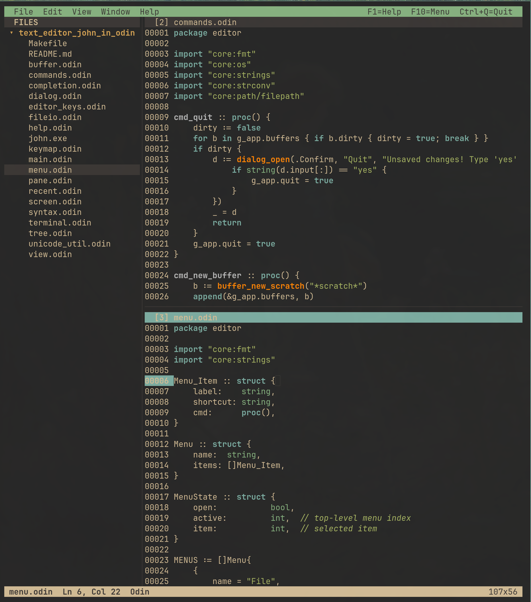

# JOHN - John simple editor in Odin

A complete text-mode editor for Linux written in [Odin](https://odin-lang.org/),
designed for programmers working on **C, C++, Odin and Python** (with extra
support for Shell, Makefile, JSON and Markdown).

## License
MIT Open Source License

## Screen




## Build & run

```sh
make clean
make
./john              # opens the current directory
./john path/to/dir  # opens a directory (file tree)
./john path/file.c  # opens a file
```

## Features

* Modal-free, **Windows-style key bindings** (Ctrl+C/X/V/Z/Y/S/O/N/F/H/G/A/Q…).
* **File tree** on the left, editor area on the right — full mouse support
  for selection, file ops and resizing the tree column.
* **Recursive splits**: split panes vertically (`Alt+\`) or horizontally
  (`Alt+-`) any number of times. Focus moves with `Alt+H/J/K/L`.  Drag
  any divider with the mouse to resize.
* **Per-pane scroll & wrap**: two panes on the same buffer scroll
  independently. `Alt+Z` toggles **soft line wrap** in the active pane.
* **Multiple buffers**, switch with `Ctrl+P` (picker), `Ctrl+Tab` (cycle),
  or `Alt+1`…`Alt+9`.
* **Mouse**: click to position the cursor, drag to select, wheel to scroll,
  click the menu bar / dropdowns / tree rows / dividers.
* **Syntax highlighting** for C, C++, Odin, Python, Shell, Makefile, JSON
  and **Markdown** (headings, lists, blockquotes, **bold**, *italic*,
  `code`, fenced code blocks, [links](url), images, horizontal rules)
  via handwritten lexers (see "Tree-sitter note" below).
* **Code completion** (`Ctrl+Space`) — keywords, builtins and identifiers
  scanned from all open buffers and from the working directory plus one
  level of sub-directories (max 20 dirs total) for `.c .cpp .cxx .cc .h
  .hpp .hh .odin .py .txt .md .markdown .mk` and `Makefile / makefile /
  GNUmakefile`. The popup is anchored on the line below the cursor and
  is clamped to screen edges so it shows correctly anywhere, including
  on the right-most columns.
* **Find / Replace** (`Ctrl+F` / `Ctrl+H`), **Go to line** (`Ctrl+G`).
* **Undo/Redo** with edit history per buffer.
* **Menu bar** (`F10`) with File / Edit / View / Window / Help.
* **Inline help** (`F1`) listing every key binding — scrollable with
  ↑/↓/PgUp/PgDn/Home/End and the mouse wheel.
* **About** dialog (Help → About) with version and feature summary.
* **Open Recent** (`Alt+R`) — last 20 files, persisted in
  `~/.config/john/recent`.
* **Status bar** showing buffer name, dirty state, language, position and size.
* **Makefile-aware tab**: in `Makefile`/`*.mk` buffers `Tab` inserts a
  literal tab character instead of spaces (so recipes work).
* Smart Home key (toggles between first non-whitespace and column 0).
* Smart newline indent (continues current line's leading whitespace).
* Selection highlighted with a high-contrast yellow background and bold
  black foreground — distinct from every syntax color (no "rose"/magenta
  tones are used anywhere in the palette).
* Word-wise motion with `Ctrl+←/→`, selection extension with `Shift`.
* Internal clipboard (`Ctrl+C`/`Ctrl+X`/`Ctrl+V`); when no selection, copy/cut
  acts on the current line (linewise paste re-inserts above the line).
* Double-buffered renderer that diffs frames to minimize ANSI output.

## Key bindings (summary)

Press **F1** in the editor for the full list. Highlights:

| Action            | Key            |
|-------------------|----------------|
| New / Open / Save / Quit | Ctrl+N / Ctrl+O / Ctrl+S / Ctrl+Q |
| Open Recent              | Alt+R |
| Close buffer / Picker    | Ctrl+W / Ctrl+P |
| Undo / Redo              | Ctrl+Z / Ctrl+Y |
| Cut / Copy / Paste / Select All | Ctrl+X / Ctrl+C / Ctrl+V / Ctrl+A |
| Find / Replace / Go to   | Ctrl+F / Ctrl+H / Ctrl+G |
| Find next / previous occurrence | F3 / Shift+F3 |
| Toggle case-sensitive search | Alt+C (works inside the Find dialog too) |
| Code completion          | Ctrl+Space |
| Toggle file tree         | Ctrl+B |
| Toggle line wrap         | Alt+Z |
| Split V / H, close pane  | Alt+\ , Alt+- , Alt+W *or* F4 |
| Focus pane left/down/up/right | Alt+H / Alt+J / Alt+K / Alt+L |
| Cycle / jump buffers     | Ctrl+Tab , Alt+1…9 |
| Duplicate / Delete line  | Ctrl+D / Ctrl+K |
| Refresh screen (re-detect terminal size) | F5 |
| Menu / Help              | F10 / F1 |
| Switch tree ↔ editor focus | F6 |

### File-tree key bindings

| Action | Key |
|--------|-----|
| Move selection | ↑ / ↓ / PgUp / PgDn / Home / End |
| Expand / collapse / open | →  /  ←  /  Enter |
| New file in selected dir | Insert  *or*  Ctrl+N |
| New folder in selected dir | Ctrl+D |
| Rename | F2 |
| Delete (asks for `yes` confirmation) | Delete |
| Refresh from disk | Ctrl+R |
| Return focus to editor | F6 / Esc |

### Mouse

| Action | Mouse |
|--------|-------|
| Place cursor / focus pane | Click on text |
| Extend selection          | Click + drag on text |
| Resize pane / tree column | Click + drag on a divider |
| Open menu                 | Click on menu bar |
| Pick command              | Click on dropdown item |
| Tree select / open        | Click on row (twice = open / toggle) |
| Scroll                    | Wheel (active pane, tree, or help) |

## Project layout

Everything is a single Odin **package `editor`** in this directory — no
sub-packages, no cross-package imports, so you can drop new files in here
and call any procedure freely.

| File                | Role                                                     |
|---------------------|----------------------------------------------------------|
| `main.odin`         | Entry point, app state, top-level event loop, mouse      |
| `terminal.odin`     | Raw mode, ANSI, key/escape parsing, SGR mouse, size      |
| `screen.odin`       | Cell back-buffer + diffing presenter                     |
| `buffer.odin`       | Text buffer, edit ops, selection, undo/redo, motion      |
| `syntax.odin`       | Per-language lexers (C, C++, Odin, Python, Shell, JSON, Markdown, Make) |
| `completion.odin`   | Identifier/keyword completion                            |
| `view.odin`         | Frame layout, pane rendering, file tree, status bar, soft wrap |
| `pane.odin`         | Split-tree (recursive) and pane focus / divider lookup   |
| `tree.odin`         | File-tree model (lazy load, expand/collapse, file ops)   |
| `menu.odin`         | Menu bar + drop-down menus + mouse helpers               |
| `dialog.odin`       | Prompt/Find/Replace/GoTo/Pick/Completion popups          |
| `commands.odin`     | All `cmd_*` procedures invoked by keys and menus         |
| `editor_keys.odin`  | Per-buffer typing & motion (commands routed via keymap)  |
| `keymap.odin`       | Configurable keybindings — reads `~/.config/john/keys.conf` |
| `help.odin`         | F1 help overlay (scrollable)                             |
| `recent.odin`       | Recently-opened-files persistence                        |
| `fileio.odin`       | Path helpers and directory listing                       |

## Configurable keybindings

Every command key in JOHN — every `Ctrl+`, `Alt+`, and F-key combination —
is configured by a plain text file at `~/.config/john/keys.conf`, side-by-side
with the recent-files list. The file is **created with every standard binding
already populated** the first time JOHN starts; if you delete it, the next
launch writes a fresh copy.

Format (one binding per line):

```
<key-combo> = <command-name>
```

* Modifiers (any order, joined with `+`): `ctrl`, `alt`, `shift`.
* Keys: `F1`–`F12`, `Tab`, `Enter`, `Escape`, `Backspace`, `Delete`, `Insert`,
  `Home`, `End`, `PageUp`, `PageDown`, `Up`, `Down`, `Left`, `Right`, `Space`,
  or any single printable character (`a`, `/`, `\`, `?`…).
* Lines starting with `#` and blank lines are ignored.

Example overrides:

```
ctrl+t = find          # use Ctrl+T instead of Ctrl+F to open Find
shift+F3 = find_prev
alt+\ = split_vertical
```

If the file has a syntax error (unknown modifier, unknown command, missing
`=`, …) JOHN refuses to start and prints exactly where the problem is:

```
john: /home/me/.config/john/keys.conf:7:12: unknown command 'no_such_action' (run with --list-commands)
```

Run `john --list-commands` to print every command name JOHN understands; only
those names are valid on the right-hand side of a binding.

## It as simple syntax highlithing for follwoing languages


```
C
Cpp
Odin
Python
Markdown
Makefile
```

## Unicode

JOHN handles UTF-8 throughout. You can edit files containing any
codepoint and the cursor moves over whole codepoints, never landing
inside a multi-byte character.

* Storage is raw UTF-8 bytes.
* Cursor `Left`/`Right` step by codepoints.
* `Backspace` and `Delete` remove a whole codepoint.
* `Home`/`End`, vertical movement, mouse clicks and the status-bar
  `Col` indicator all work in *display columns*.
* `Ctrl+←`/`Ctrl+→` (word jump) treat any non-ASCII byte as part of a
  word, so accented identifiers like `café` and `naïve` are jumped as
  single units.
* The dialog boxes (Find, Replace, Open, Goto, etc.) accept and edit
  UTF-8 input the same way.

Tested with Latin (`Café — naïve façade`), Greek (`αβγδε`), Cyrillic
(`Привет`), CJK (`日本語テスト中文测试한국어`) and emoji (`🚀 🎉 ✨`).

Note: very wide CJK glyphs and emoji currently render at a single
terminal cell width — they appear, just not double-width.

## Limitations

* CJK / wide glyphs are rendered as single-width.
* No project-wide search yet (per-buffer Find/Replace works).

---

## Full key bindings reference

### General
| Key | Action |
| --- | --- |
| `F1` / `Ctrl+?` | Toggle help dialog |
| `F10` | Open the menu bar |
| `F6` | Toggle focus between file tree and editor |
| `Ctrl+Q` | Quit (asks if any buffer is dirty) |
| `Esc` | Cancel selection / close dialog / leave tree focus |

### File
| Key | Action |
| --- | --- |
| `Ctrl+N` | New scratch buffer |
| `Ctrl+O` | Open file (path prompt) |
| `Ctrl+R` | Refresh the file tree from disk (rescans every loaded directory) |
| `Alt+R`  | Open recent (last 20 files, persisted to `~/.config/john/recent`) |
| `Ctrl+S` | Save current buffer |
| `Ctrl+W` | Close current buffer (asks if dirty) |
| `Ctrl+P` | Pick buffer from list |
| `Ctrl+Tab` | Cycle to next buffer |
| `Alt+1` … `Alt+9` | Jump directly to buffer N |

### Edit (Windows-style)
| Key | Action |
| --- | --- |
| `Ctrl+Z` | Undo |
| `Ctrl+Y` | Redo |
| `Ctrl+C` | Copy selection (or current line if no selection) |
| `Ctrl+X` | Cut selection (or current line) |
| `Ctrl+V` | Paste (line-mode if last copy was a whole line) |
| `Ctrl+A` | Select all |
| `Ctrl+D` | Duplicate current line |
| `Ctrl+K` | Delete current line |
| `Ctrl+L` | Select current line |
| `Alt+D` | Delete next word |
| `Tab` | Indent (4 spaces; literal TAB inside Makefiles) |
| `Enter` | Newline preserving the previous line's indent |

### Motion & selection
| Key | Action |
| --- | --- |
| `←` `→` `↑` `↓` | Move cursor (codepoint-aware) |
| `Shift+arrow` | Extend selection |
| `Ctrl+←` / `Ctrl+→` | Word jump |
| `Ctrl+Shift+←` / `Ctrl+Shift+→` | Word jump with selection |
| `Home` | Smart line start (toggle between indent and column 0) |
| `End` / `Ctrl+E` | Move to end of line |
| `PageUp` / `PageDown` | Page scroll (independent per pane) |

### Search
| Key | Action |
| --- | --- |
| `Ctrl+F` | Open Find dialog. Pre-filled with the previous needle so `Enter` repeats the last search. The prompt label shows the current case-sensitivity mode. |
| `F3` | Find **next** occurrence (forward, wraps at end of buffer) |
| `Shift+F3` | Find **previous** occurrence (backward, wraps at start of buffer) |
| `Alt+C` | Toggle **case-sensitive ↔ case-insensitive** search. Works as a global key *and* inside the Find/Replace dialog — the dialog prompt label updates live so you can see the current mode. |
| `Ctrl+H` | Replace all (uses the same case-sensitivity setting) |
| `Ctrl+G` | Go to line |

The case-sensitivity setting persists for the rest of the session (and is shared by Find, Find Next/Previous and Replace All). Default at startup is **case-insensitive**.

### Completion
| Key | Action |
| --- | --- |
| `Ctrl+Space` | Open completion popup (anchored under the cursor) |
| `↑` / `↓` | Move selection in the popup |
| `Enter` | Insert chosen completion |
| `Esc` | Dismiss popup |

Sources: language keywords/builtins, identifiers from all open
buffers, identifiers scanned from `.c`, `.cc`, `.cpp`, `.cxx`,
`.h`, `.hpp`, `.hh`, `.odin`, `.py`, `.md`, `.markdown` and
`Makefile` files in the project (cwd + 1 level of subdirs, up to 20
directories).

### View & windows
| Key | Action |
| --- | --- |
| `Alt+\` | Split active pane vertically |
| `Alt+-` | Split active pane horizontally |
| `Alt+W` *or* `F4` | Close active pane (and full repaint) |
| `Alt+H` / `Alt+L` / `Alt+K` / `Alt+J` | Move focus left / right / up / down |
| `Alt+Z` | Toggle soft line wrap on the active pane |
| `Ctrl+B` | Show / hide the file tree |
| `F5` | Refresh screen — re-query terminal size and force a full repaint (use this after changing the terminal font size or zoom) |

### File tree (when focused — `F6` toggles)
| Key | Action |
| --- | --- |
| `↑` / `↓` | Move selection |
| `PageUp` / `PageDown` | Move 10 entries |
| `Home` / `End` | Jump to first / last entry |
| `Enter` | Open file, or expand/collapse directory |
| `Right` / `Left` | Expand / collapse directory |
| `n` | Create new file inside selected directory |
| `r` | Rename selected file |
| `d` / `Delete` | Delete selected file (with confirmation) |
| `R` | Refresh directory listing |
| `Esc` / `F6` | Return focus to the editor |

### Mouse
| Action | Effect |
| --- | --- |
| Click in a pane | Focus that pane and move the cursor (codepoint-aware) |
| Click + drag in a pane | Extend the selection |
| Click in file tree | Focus and select that entry |
| Double-feel: click on tree directory | Expand / collapse |
| Click on a menu name | Open that dropdown |
| Click on a menu item | Run it |
| Click on a vertical split divider and drag | Resize the two panes |
| Click on the file-tree divider and drag | Resize the tree |
| Mouse wheel up/down | Scroll the focused pane / tree / help |

### Dialogs
| Key | Action |
| --- | --- |
| `Enter` | Confirm (or move to next field in Replace) |
| `Esc` | Cancel and close |
| `Tab` (inside Replace) | Switch between Find and Replace fields |
| `←` `→` `Home` `End` | Edit the input (codepoint-aware) |
| `Backspace` / `Delete` | Erase a codepoint |

### Persistence
* Open recent files: `~/.config/john/recent`
* Keybindings:       `~/.config/john/keys.conf` (auto-created with the
  defaults; edit freely. See **Configurable keybindings** above for the
  format.)
* The recent list is updated automatically every time you open a file.

### Scrolling inside Help
| Key | Action |
| --- | --- |
| `↑` / `↓` | Scroll one line |
| `PageUp` / `PageDown` | Scroll one screen |
| `Home` / `End` | Jump to top / bottom |
| Mouse wheel | Scroll |
| `Esc` / `F1` | Close |

## Have fun
Best regards, <br>
Joao Carvalho <br>